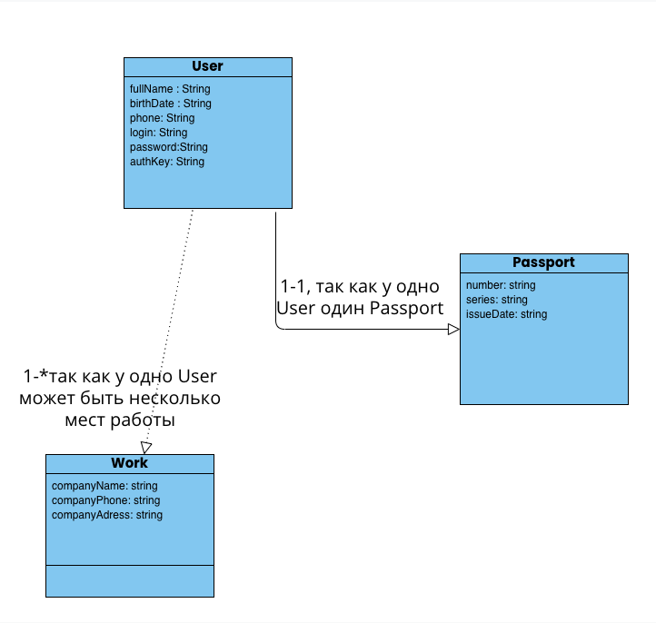

Есть клиент-серверное приложение. Нужно написать API для регистрации и авторизации пользователей, на основе данных, которые будут приходить с клиента.

Стек:
Node.js
Express.js

Задания:
1.	Продумать модель данных в который будет храниться информация. Требуется хранить следующие данные:
      −	ФИО
      −	Дата рождения
      −	Телефон
      −	Данные документа удостоверяющего личность(серия, номер, дата выдачи)
      −	Данные о работе (Название фирмы, номер телефона, адресс )
      −	Ключ для авторизации
      Модель нужно отрисовать в формате диаграммы классов UML. Для простоты из связей использовать только ассоциация, а связи между сущностями могут быть или 1-1 или 1-*.
2.	Реализовать функции-конструкторы под каждую сущность. Они должны храниться в папке models.
3.	Реализовать генератор ключей. Он должен генерировать рандомную последовательность чисел, букв или символов. Сохранить его в папке utils.
4.	Реализовать следующие routes:
      4.1.	/user/register - должен получать данные сведения о регистрируемом пользователе и сохранять их в БД с присвоением ключа для авторизации (в рамка тестового задания можно хранить их в отдельном файле в  формате json в папке db). 	
      4.1.1.	* Сделать проверку на то, что пользователь ещё не был зарегистрирован.
      4.1.2.	**При желании можно использовать и реальную базу, например SQLite.
      4.2.	/user/login - должен получать логин и пароль пользователя, искать пользователя в хранилище созданом в рамках задания 4.1. Если пользователь найден, то должен возвращаться 200 статус и ключ авторизация пользователя, если нет, то 403 с сообщением, что пользователь не найден.
5.	Выгрузить проект в git.

Пункты с * это задачи с повышенной сложность и их можно не делать, а если и делать, то в последнюю очередь. Не обязательно выполнять все задание полностью, если не успеваете, то можно прислать, то что успели сделать.